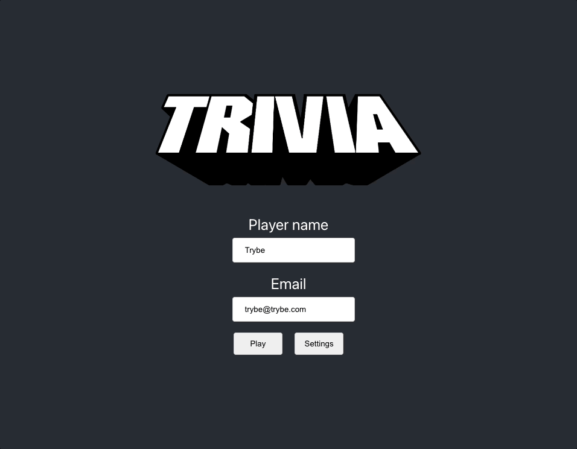

# Welcome to the Trivia project repository!

### README Translations:

-   [English](/README.en.md)
-   [Portuguese](/README.md)

* * *

## 👨‍💻 What was developed:

-   A question and answer game based on the Trivia game was developed, using React and Redux, developing its features according to the demands defined in a Kanban board. From these demands, we have an application where the user can:
    -   Log into the game and, if the email is registered on the site[Gravatar](https://pt.gravatar.com/), have your photo associated with the user's profile.
    -   Access the page related to the game, where you must choose one of the answers available for each of the questions presented. The answer must be marked before the timer reaches zero, otherwise the answer will be considered wrong.
    -   Be redirected, after 5 questions answered, to the score screen, where the text shown depends on the number of hits.
    -   View the ranking page, if you like, at the end of each game.
    -   Configure some options for the game in a configuration screen accessible from the app header.

:bulb:**See a sample below:**

## Skills used:

-   Create a Redux store in React applications
-   Create reducers in Redux in React applications
-   Create Redux Actions in React Applications
-   Create Redux dispatchers in React applications
-   Connect Redux to React components
-   Create asynchronous actions in your React application that makes use of Redux.
-   Write tests to ensure your application has good test coverage.

# requirements

## Start/login screen

> Note: The Login page must have the path`src/pages/Login.js`

## 1. Create the login screen, where the person who plays must fill in the information to start a game

**PRIORITY 0**

Create the login screen containing the name and email information, where the person who plays must be able to write his name and email in the inputs and the play button ("Play") must be disabled if he does not have any of this information.

:bulb: We recommend that Redux and Router are configured in this requirement, so that the others can be done in parallel!

:warning:**Keep in mind the technical notes described above to configure the`store`do`Redux`.**

  
<strong> Observações técnicas:</strong>

-   The person playing must be able to write their name in the text input

-   The person playing must be able to write their email in the email input

-   The "Play" button must be disabled if email and/or name are not filled

-   The text field for the name must have the attribute`data-testid`with the value`input-player-name`

-   The text field for the email must have the attribute`data-testid`with the value`input-gravatar-email`

-   The "Play" button that takes the person to the game must have the attribute`data-testid`with the value`btn-play`
    

     

      
<strong>O que será verificado</strong>

-   It will be validated if it is possible to write the name of the player

-   It will be validated if it is possible to write the email of the player

-   It will be validated if the "Play" button is disabled when the player does not fill in any fields

-   It will be validated if the "Play" button is disabled when the player only writes the name

-   It will be validated if the "Play" button is disabled when the player only writes the email

-   It will be validated if the "Play" button is enabled when the player fills in the name and email fields
    

* * *

## 2. Create the game start button

**PRIORITY 1**

The "Play" button must make a request to the API to get the token and redirect the person to the game screen

  
<strong> Observações técnicas:</strong>

-   By clicking the "Play" button, a request to the Trivia API must be made to get the_token_of player

-   After clicking the "Play" button, the person should be redirected to the game screen. The redirection should only happen after returning the token by the API.

-   O_token_must be stored and sent in all subsequent requests.

-   Hi no`localStorage`the value of_token_received in the Trivia API, using the key`token`.
    

     

      
<strong>O que será verificado</strong>

-   It will be validated if by clicking on the "Play" button the game is started saving a player token
    

* * *

## 3. Create a button that takes the person to the configuration screen

**PRIORITY 1**

The home screen should contain a button that takes you to the game's configuration

  
<strong> Observações técnicas:</strong>

-   The button that takes the person to the settings screen must have the attribute`data-testid`with the value`btn-settings`

-   The settings screen must have a title with the attribute`data-testid`containing the value`settings-title`
    

     

      
<strong>O que será verificado</strong>

-   It will be validated if the button exists on the page

-   It will be validated if the settings screen has a title
    

* * *

## 4. Develop tests to achieve 90% Login screen coverage

> :bulb: Note: In this requirement we are going to cover our login screen with unit tests using the library[React Testing Library](https://testing-library.com/docs/react-testing-library/intro/), take this opportunity to put into practice the[Test Driven Development](https://blog.betrybe.com/tecnologia/tdd-test-driven-development/)

**PRIORITY 1**

Login screen test coverage

  
<strong> Observações técnicas:</strong>

-   The tests you create will not influence the other requirements in the evaluator. You will develop your unit/integration tests using the React Testing Library, while the evaluator will use the library[Cypress](https://docs.cypress.io/)to assess requirements, including coverage requirements.

-   For the tests to pass it is necessary that the Login page has the path`src/pages/Login.js`
    

     

      
<strong>O que será verificado</strong>

-   It will be validated if when executing`npm run test-coverage`the following results are obtained:
          * `% Funcs` e `% Lines` da linha `Login` é maior ou igual a 90.
    

* * *

## game screen

> Note: It is necessary that the Game page has the path`src/pages/Game.js`

## 5. Create a_header_which must contain the player's information

**PRIORITY 1**

O_header_must contain information about the player, such as Gravatar's image, name and score

  
<strong> Observações técnicas:</strong>

-   The profile image from Gravatar on an element that must have the attribute`data-testid`with the value`header-profile-picture`
-   The name of the person in an element that must have the attribute`data-testid`with the value`header-player-name`
-   The score set to zero on an element that must have the attribute`data-testid`with the value`header-score`
    

 

  
<strong>O que será verificado</strong>

-   It will be validated if the Gravatar image is present in the header
-   It will be validated if the person's name is present in the header
-   It will be validated if the zeroed score is present in the header
    

* * *

## 6. Create the game page which should contain the information related to the question

**PRIORITY 1**

A request must be made to the API to populate the game with the questions, category and alternatives

 Ilustração:

 

  
<strong> Observações técnicas:</strong>

-   Accessing the game with an invalid token leads to a logout, deleting the token from the`localStorage`and redirecting the page to the login screen
-   The question and its answer alternatives must be received from the Trivia API
-   Only**one**question must be displayed at a time
-   The question category (field_category_) must be displayed in an element with the attribute`data-testid`with the value`question-category`to the person playing
-   The question text (field_question_) must be displayed in an element with the attribute`data-testid`with the value`question-text`to the person playing
-   

 O texto com as alternativas devem ser exibidos seguindo as regras abaixo:

        * Os botões das alternativas devem ser elementos irmãos; ou seja, não podem estar dentro de outra tag
        * O elemento com a alternativa correta deve possuir o atributo `data-testid` com o valor `correct-answer`
        * Os elementos com as alternativas incorretas devem possuir o atributo `data-testid` com o valor `wrong-answer-${index}`, com `${index}` iniciando com o valor `0`
        * As alternativas devem estar dentro de uma tag que possui o atributo `data-testid` com o valor `answer-options`
        * As alternativas devem ser exibidas em ordem aleatória
        * Dica: utilize botões (`<button/>`) para as alternativas

      

    

 

  
<strong>O que será verificado</strong>

-   It will be validated if the invalid token is deleted and the application is redirected
-   Will be validated if API responses are handled correctly
-   It will be validated if the question category is present
-   It will be validated if the question text is present
-   It will be validated if the alternatives are present
-   It will be validated if the number of correct alternatives is 1
-   It will be validated if the alternatives are positioned in random order
    

* * *

## 7. Develop the style that, when clicking on an answer, the correct one should be green and the incorrect ones, red

**PRIORITY 2**

When answering the question, if the alternative is correct, it should be green, otherwise, red

  
<strong> Observações técnicas:</strong>

-   Use css property`border`with the value`3px solid rgb(6, 240, 15)`for the correct alternative.
-   Use css property`border`with the value`3px solid red`for the incorrect alternatives.
    

 

  
<strong>O que será verificado</strong>

-   It will be validated if the color of the correct alternative is "rgb(6, 240, 15)" when correcting the question
-   It will be validated if the color of incorrect alternatives is set to "red" when correcting the question.
-   It will be validated if the color of the correct alternative is "rgb(6, 240, 15)" when making a mistake
-   It will be validated if the color of incorrect alternatives is set to "red" when getting the question wrong
    

* * *

## 8. Develop a timer where the person playing has 30 seconds to respond

**PRIORITY 3**

The page must contain a timer with a maximum time of 30 seconds to respond. If it exceeds the time, the question is considered wrong

  
<strong> Observações técnicas:</strong>

-   If the question is not answered in time, the answer is considered wrong.
-   Incorrect answers do not add points to the scoreboard
-   A timer should appear on the person's screen, starting from 30 seconds and descending to zero.
-   After the time runs out, all alternative buttons must be disabled

    :bulb:**Tip**: Remember the`setTimeout`It's from`setInterval`

    

 

  
<strong>O que será verificado</strong>

-   It will be validated if it is possible to wait 5 seconds and answer the correct alternative
-   It will be validated if when waiting more than 30 seconds to respond, all buttons are disabled
    

* * *

## 9. Create the scoreboard with the following characteristics:

**PRIORITY 3**

By clicking on the correct answer, points must be added to the score of the person who is playing

  
<strong> Observações técnicas:</strong>

-   You must save the score**current**in redux state in player.score key
-   :bulb: Read the Technical Notes sub-section, in the[:convenience store: Development](#orientações)for more details
-   Wrong answers should not add to the score
-   The formula for calculating points per question is:`10 + (timer * dificuldade)`, where timer is the time remaining in the time counter and difficulty is`hard: 3, medium: 2, easy: 1`, depending on the question. :bulb: Example: If at the time of the correct answer the timer is counting 17 seconds, and the question difficulty is 2 (average), the score should be:`10 + (17 * 2) = 44`
    

 

  
<strong>O que será verificado</strong>

-   It will be validated if the points are added for getting a question right
-   It will be validated if the points are not added for getting a question wrong
    

* * *

## 10. Create a button`Next`that appears after the answer is given

**PRIORITY 3**

A "Next" question button should appear after the answer is given

  
<strong> Observações técnicas:</strong>

-   The "Next" button must have the attribute`data-testid`with the value`btn-next`
-   By clicking this button, the next question should appear on the screen
    

 

  
<strong>O que será verificado</strong>

-   It will be validated if the "Next" button does not exist at the beginning of the game
-   It will be validated if the "Next" button is present when the question is answered correctly
-   It will be validated if the "Next" button is present when the question is answered incorrectly
    

* * *

## 11. Develop the game so that the player must answer 5 questions in total

**PRIORITY 2**

The game must consist of 5 questions, where, with each new question, the timer is reset. After answering them, the person playing should be redirected to the feedback screen

  
<strong> Observações técnicas:</strong>

-   With each new question the timer must be reset to 30 seconds
-   After the fifth question, the "Next" button should redirect the person to the_Feedback_
-   For questions with type:"boolean", show only 2 fields (one for each possible answer)
-   For questions with type:"multiple", show the required amount of fields (one for each possible answer)
    

 

  
<strong>O que será verificado</strong>

-   It will be validated if when clicking on the "Next" button, a new question is displayed
-   It will be validated if the points are added correctly when all the answers are correct
-   It will be validated if the points are added correctly when all the answers are wrong
-   It will be validated if the user is redirected to the_feedback_after the fifth question
    

* * *

## feedback screen

> Note: The Feedback page must have the path`src/pages/Feedback.js`

## 12. Develop the header of_feedback_which must contain the player's information

**PRIORITY 2**

The feedback screen must contain the information of the person playing, including the score with the value referring to the performance in the game

  
<strong> Observações técnicas:</strong>

-   The profile image from Gravatar on an element that must have the attribute`data-testid`with the value`header-profile-picture`
-   The name of the person in an element that must have the attribute`data-testid`with the value`header-player-name`
-   The score with the value**current**on an element that must have the attribute`data-testid`with the value`header-score`
    

 

  
<strong>O que será verificado</strong>

-   It will be validated if the Gravatar image is present in the header
-   It will be validated if the person's name is present in the header
-   It will be validated if the score with the current value is present in the header
    

* * *

## 13. Create the message from_feedback_to display the user

**PRIORITY 1**

The feedback screen should display a message related to the performance of the person who played

  
<strong> Observações técnicas:</strong>

-   The message should be "Could be better..." if the person gets less than 3 questions right
-   The message should be "Well Done!" if the person gets 3 questions right or more
-   The message element_feedback_must have the attribute`data-testid`with the value`feedback-text`
    

 

  
<strong>O que será verificado</strong>

-   It will be validated if, when correcting less than 3 questions, the message_feedback_é "Could be better..."
-   It will be validated if, when correcting 3 questions, the message_feedback_is "Well Done!"
-   It will be validated if, by hitting more than 3 questions, the message_feedback_is "Well Done!"
    

* * *

## 14. Display the information related to the results obtained for the user person

**PRIORITY 1**

The feedback screen should display information about the person's performance, such as the final score and the number of questions they got right.

  
<strong> Observações técnicas:</strong>

-   The final score must be shown in an element with the attribute`data-testid`with the value`feedback-total-score`
-   The number of questions the person got right must be displayed in an element with the attribute`data-testid`with the value`feedback-total-question`
-   The elements with the`data-testid`must have only the number
-   No`estado do redux`score keys and assertions must be of type number
    

 

  
<strong>O que será verificado</strong>

-   It will be validated if the displayed number is correct when the user does not answer any question
-   It will be validated if the displayed number is correct when the user gets 2 questions right
-   It will be validated if the displayed number is correct when the user answers 4 questions
    

* * *

## 15. Create the option for the player to be able to play again

**PRIORITY 3**

The person will have the option to play again ("Play Again") which, when clicked, will take you to the home screen

  
<strong> Observações técnicas:</strong>

  
  * Ao clicar no botão "Play Again", a pessoa deve ser redirecionada para a tela de início (login)
  * O botão para "Play Again" deve possuir o atributo `data-testid` com o valor `btn-play-again`

 

  
<strong>O que será verificado</strong>

-   It will be validated if the person is redirected to the home screen when clicking on the "Play Again" button
    

* * *

## 16. Create the option for the player to be able to view the screen of_ranking_

**PRIORITY 3**

There must be a button that redirects the person to the ranking screen

  
<strong> Observações técnicas:</strong>

-   By clicking on the "Ranking" button, the person must be redirected to the_ranking_
-   The button to go to the screen_ranking_must have the attribute`data-testid`with the value`btn-ranking`
-   the screen of_ranking_must have a title with the attribute`data-testid`containing the value`ranking-title`
    

 

  
<strong>O que será verificado</strong>

-   It will be validated if, when clicking on the "Ranking" button, the person is redirected to the ranking screen
    

* * *

## 17. Develop tests to achieve 90% Feedbacks screen coverage

> :bulb: Note: In this requirement we are going to cover our Feedbacks screen with unit tests using the library[React Testing Library](https://testing-library.com/docs/react-testing-library/intro/), take this opportunity to put into practice the[Test Driven Development](https://blog.betrybe.com/tecnologia/tdd-test-driven-development/)

**PRIORITY 2**

Feedbacks screen test coverage

  
<strong> Observações técnicas:</strong>

-   The tests you create will not influence the other requirements in the evaluator. You will develop your unit/integration tests using the React Testing Library, while the evaluator will use the library[Cypress](https://docs.cypress.io/)to assess requirements, including coverage requirements.
-   For the tests to pass it is necessary that the Feedbacks page has the path`src/pages/Feedback.js`
    

 

  
<strong>O que será verificado</strong>

-   It will be validated if when executing`npm run test-coverage`the following results are obtained:
          * `% Funcs` e `% Lines` da linha `Feedback` é maior ou igual a 90.
    

* * *

## tel A's ranking

> Note: The Ranking page must have the path`src/pages/Ranking.js`

## 18. Create a button to go to the beginning

**PRIORITY 2**

The button should redirect the person to the home (login) screen

  
<strong> Observações técnicas:</strong>

-   This button must have the attribute`data-testid`with the value`btn-go-home`
-   This button should send the person to the beginning (data filling screen)
    

 

  
<strong>O que será verificado</strong>

-   It will be validated if, when clicking on the button, the person returns to the home screen
    

* * *

## 19. Create the contents of the screen of_ranking_

**PRIORITY 2**

The ranking screen must have a list with the image, name and score of the people who played and must be stored in localStorage

  
<strong> Observações técnicas:</strong>

-   You must show a list with the profile picture from Gravatar, name and score of the people who played in descending order (highest score to lowest)
-   Elements with the names of the people who played must have the attribute`data-testid`with the value`player-name-${index}`, Where`${index}`starts at zero
-   Elements with the scores of people who played must have the attribute`data-testid`with the value`player-score-${index}`, Where`${index}`starts at zero
-   The ranking must be stored in the browser through the`localStorage`.
-   read the section[Technical remarks](#observações-técnicas)for more details
    

 

  
<strong>O que será verificado</strong>

-   It will be validated if there is a person in the_ranking_
-   It will be validated if there are two people in the_ranking_
-   It will be validated if the_ranking_is sorted by score
    

* * *

## 20. Develop tests to achieve 90% coverage of the Ranking screen

> :bulb: Note: In this requirement we are going to cover our Ranking screen with unit tests using the library[React Testing Library](https://testing-library.com/docs/react-testing-library/intro/), take this opportunity to put into practice the[Test Driven Development](https://blog.betrybe.com/tecnologia/tdd-test-driven-development/)

**PRIORITY 2**

Ranking screen test coverage

  
<strong> Observações técnicas:</strong>

-   The tests you create will not influence the other requirements in the evaluator. You will develop your unit/integration tests using the React Testing Library, while the evaluator will use the library[Cypress](https://docs.cypress.io/)to assess requirements, including coverage requirements.
-   For the tests to pass it is necessary that the Ranking page has the path`src/pages/Ranking.js`
    

 

  
<strong>O que será verificado</strong>

-   It will be validated if when executing`npm run test-coverage`the following results are obtained:
          * `% Funcs` e `% Lines` da linha `Ranking` é maior ou igual a 90.
    

* * *

## Game screen tests

## 21. Develop tests to achieve 90% coverage of the Game screen

> :bulb: Note: In this requirement we are going to cover our Game screen with unit tests using the library[React Testing Library](https://testing-library.com/docs/react-testing-library/intro/), take this opportunity to put into practice the[Test Driven Development](https://blog.betrybe.com/tecnologia/tdd-test-driven-development/)

**PRIORITY 3**

Game screen test coverage

  
<strong> Observações técnicas:</strong>

-   The tests you create will not influence the other requirements in the evaluator. You will develop your unit/integration tests using the React Testing Library, while the evaluator will use the library[Cypress](https://docs.cypress.io/)to assess requirements, including coverage requirements.
-   For the tests to pass it is necessary that the Game page has the path`src/pages/Game.js`
    

 

  
<strong>O que será verificado</strong>

-   It will be validated if when executing`npm run test-coverage`the following results are obtained:
          * `% Funcs` e `% Lines` da linha `Game` é maior ou igual a 90.
    

* * *

## Application coverage tests

## 22. Develop tests to achieve 95% full coverage

> :bulb: Note: In this requirement we are going to cover our application with unit tests using the library[React Testing Library](https://testing-library.com/docs/react-testing-library/intro/), take this opportunity to put into practice the[Test Driven Development](https://blog.betrybe.com/tecnologia/tdd-test-driven-development/)

**PRIORITY 3**

Application testing coverage

  
<strong> Observações técnicas:</strong>

-   The tests you create will not influence the other requirements in the evaluator. You will develop your unit/integration tests using the React Testing Library, while the evaluator will use the library[Cypress](https://docs.cypress.io/)to assess requirements, including coverage requirements.
    

 

  
<strong>O que será verificado</strong>

-   It will be validated if when executing`npm run test-coverage`the following result is obtained:
          * `% Branch` da linha `All files` é maior ou igual a 95.
    

* * *

# non-evaluative requirements

## settings screen

### 23. When changing the value of the category dropdown, only questions from the selected category should appear for the person playing. This configuration will be identified by the category key in the API return;

* * *

### 24. When changing the difficulty dropdown value, only questions of the selected difficulty should appear for the person playing. This setting will be identified by the difficulty key in the API return;

* * *

### 25. When changing the type dropdown value, only questions of the selected type should appear for the person playing. This configuration will be identified by the type key in the API return.

**_Note: The way the API should be structured follows the following model:<https://opentdb.com/api_config.php>_**
